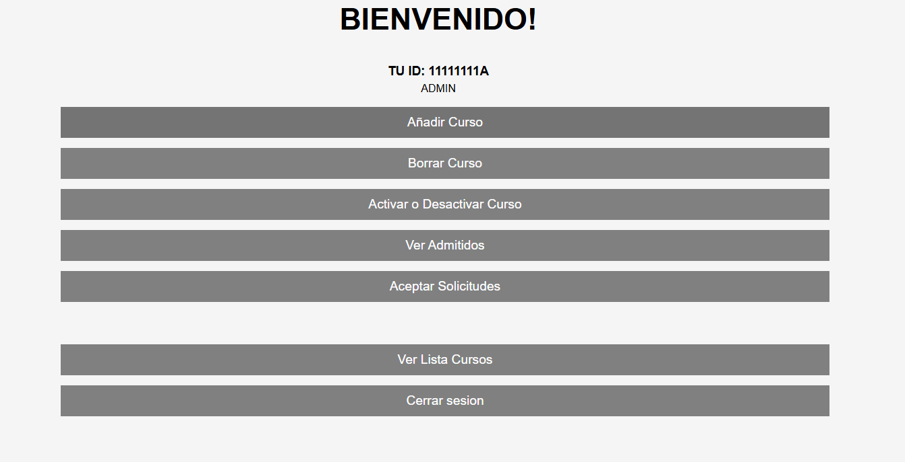

# 📚 Gestión de Cursos

Este es un proyecto de **gestión de cursos** desarrollado en PHP. Permite la administración de cursos, usuarios y solicitudes de inscripción, todo a través de una interfaz web interactiva.

## ✨ Características

- 🖥️ **Gestión de cursos**: El administrador puede añadir, borrar y desactivar cursos según el estado de inscripción.
- 🧑‍🎓 **Inscripción de usuarios**: Los usuarios pueden solicitar la inscripción a los cursos disponibles.
- 📧 **Confirmación por correo electrónico**: Cuando un usuario es aceptado en un curso, se envía una notificación de confirmación por correo.
- 🗓️ **Control de fechas**: Los cursos pueden desactivarse por parte del administrador cuando su plazo de inscripción haya expirado.
- 🔒 **Gestión de usuarios**: Los administradores tienen control total sobre las inscripciones y los cursos disponibles.

## 📷 Captura de Pantalla

## 🔧 Requisitos

Este proyecto requiere un servidor web con PHP y acceso a una base de datos MySQL. Puedes usar **XAMPP**, **MAMP** o cualquier servidor PHP compatible.

- PHP 7.0 o superior
- MySQL
- Servidor web (Apache, Nginx, etc.)

## ℹ️ Instalación y Uso

Sigue estos pasos para instalar y usar el proyecto:

1. **Clona el repositorio**:
   git clone https://github.com/mariodiazzz11/GestionDeCursos.git
   
2. **Configura la base de datos**:
   - Importa el archivo SQL de la base de datos en tu servidor MySQL.
   - Asegúrate de configurar las credenciales de la base de datos en el archivo `config.php`.
   
3. **Accede al proyecto en tu servidor web**:
   - Copia los archivos del proyecto a la carpeta raíz de tu servidor web (por ejemplo, `htdocs` si usas XAMPP).
   - Abre el navegador y accede a `localhost/GestionDeCursos` para ver el proyecto en acción.

4. **Accede como administrador**:
   - Utiliza las credenciales predeterminadas para acceder al panel de administración y gestionar los cursos y usuarios.

## ⚙️ Personalización

Puedes personalizar el proyecto según tus necesidades:

- **Base de datos**: Edita la estructura de la base de datos según los requerimientos de tu institución o empresa.
- **Estilos**: Modifica los archivos CSS para cambiar el diseño y los colores.
- **Funcionalidad**: Ajusta los archivos PHP si deseas modificar la lógica de inscripción, gestión de cursos, o correos electrónicos.

## 🚀 Contribuciones 

Si deseas contribuir a este proyecto:

1. **Haz un fork del repositorio.**
2. **Crea una rama para tus cambios**:
   git checkout -b nombre-de-tu-rama
3. **Realiza tus modificaciones y haz un commit**:
   git commit -m "Descripción de tus cambios"
4. **Envía un pull request**.

## ✉️ Licencia

**Este proyecto está bajo la Licencia MIT. Consulta el archivo LICENSE para más información.**

## ⭐️ Fomenta el crecimiento del proyecto

Si te ha gustado este proyecto o lo encuentras útil, ¡no dudes en darle una estrella! ⭐️

Las estrellas ayudan a otros usuarios a encontrar este repositorio y a motivarme a seguir mejorando y manteniendo el proyecto.

Si quieres colaborar o hacer cambios personalizados, siéntete libre de hacer un **fork** y trabajar sobre tu propia versión. ¡Cualquier contribución es bienvenida! 🙌

**Cómo puedes ayudar**:
1. Da una estrella ⭐️ al repositorio.
2. Haz un fork para modificar o mejorar el código.
3. Abre un *pull request* con tus mejoras o correcciones.

¡Gracias por tu apoyo! 🙏
